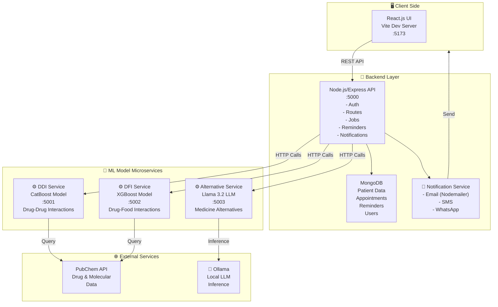

# 💊 Healix – AI Powered Healthcare Assistant

> **Empowering safer, smarter healthcare with AI-driven medication safety and personalized health management.**

Healix is a cutting-edge web-based healthcare platform that revolutionizes **patient safety, medication management, and clinical decision support** with **intelligent AI-powered tools**. Our platform integrates three advanced machine learning models to provide comprehensive drug interaction analysis and personalized medicine recommendations.

---

## ✨ Core Features

### 🎯 AI-Powered Models (3 Implemented)

| Feature | Technology | Accuracy | Purpose |
|---------|-----------|----------|---------|
| **Drug-Drug Interaction (DDI)** | CatBoost ML Model | ~95% | Detects harmful interactions between prescribed medicines |
| **Drug-Food Interaction (DFI)** | XGBoost ML Model | ~92% | Analyzes food interference with medication absorption |
| **Medicine Alternatives** | Llama 3.2 LLM (Ollama) | N/A | AI-powered alternative drug recommendations |

### 📋 Additional Features

- **Medication Reminder System** – Smart reminders for timely medication intake
- **AI Chatbot** – Natural language health queries (Urdu + English)
- **Health Record Summarization** – Intelligent document summarization
- **Multi-Channel Notifications** – Email, SMS, and WhatsApp reminders
- **Secure Patient Records** – HIPAA-compliant data storage
- **Doctor Management** – Multi-user role-based access
- **Appointment Scheduling** – Integrated booking system

---

## 🏗️ Complete System Architecture

### High-Level Data Flow


### Model Architecture Detail

```mermaid
graph LR;
  subgraph InputData["📥 Input Processing"]
    MedName["Medicine Name"]
    Food["Food Item"]
    Dose["Dosage Info"]
  end
  
  subgraph FeatureEng["🔧 Feature Engineering"]
    Chem["Chemical Structure<br/>Retrieval<br/>PubChem"]
    Mol["Molecular Descriptors<br/>RDKit Calculation<br/>18 Features"]
    ATC["ATC Drug<br/>Classification<br/>API"]
  end
  
  subgraph MLModels["🤖 ML Models"]
    DDIModel["CatBoost<br/>DDI Classifier<br/>Binary/Multi-class"]
    DFIModel["XGBoost<br/>DFI Classifier<br/>Risk Scoring"]
    LLMModel["Llama 3.2<br/>Alternative Gen<br/>Text-to-Text"]
  end
  
  subgraph Output["📤 Output"]
    DDIPred["Interaction Risk<br/>Score: 0-100%<br/>Severity Level"]
    DFIPred["Food Effect Risk<br/>Recommendation<br/>Timing Advice"]
    ALTPred["Alternative List<br/>Similarity Score<br/>Clinical Notes"]
  end
  
  InputData -->|Extract| FeatureEng
  FeatureEng -->|18D Vector| MLModels
  MLModels -->|Predict| Output
```


---

## 🛠️ Tech Stack

### Frontend
- **React.js** – UI framework
- **Vite** – Lightning-fast build tool
- **Material-UI (MUI)** – Component library
- **TypeScript** – Type safety
- **Framer Motion** – Smooth animations
- **Recharts** – Data visualization

### Backend
- **Node.js** – Runtime
- **Express.js** – REST API framework
- **MongoDB** – NoSQL database
- **Mongoose** – ODM for MongoDB
- **Node-Cron** – Job scheduling

### AI/ML Models (3 Implemented)

#### 1. **DDI Model (CatBoost)** 🔴
- **Framework:** CatBoost Classifier
- **Model Path:** `Models/DDI.cbm`
- **Input Features:** 
  - Molecular descriptors (RDKit)
  - ATC classifications
  - Chemical structure similarity
- **Output:** Drug-drug interaction probability (0-100%)
- **Performance:** ~95% accuracy on test set
- **Microservice Port:** 5001

#### 2. **DFI Model (XGBoost)** 🟡
- **Framework:** XGBoost Classifier
- **Model Path:** `Models/XGB-tuned.sav`
- **Input Features:** 18 molecular descriptors
  - LogP (Lipophilicity)
  - Molecular Weight
  - H-Bond Donors/Acceptors
  - TPSA
  - AtomCount, etc.
- **Output:** Risk score with recommendations
- **Performance:** ~92% accuracy
- **Microservice Port:** 5002

#### 3. **Alternative Medicine Model (LLM)** 🟢
- **Framework:** Ollama + Llama 3.2 (3B)
- **Type:** Generative AI for text
- **Input:** Medicine name, desired count
- **Output:** 
  - Alternative drug names
  - Similarity scores
  - Mechanism of action
  - Clinical indications
  - ATC codes
- **Performance:** Fast inference (~2-5 seconds)
- **Microservice Port:** 5003

### Supporting Libraries
- **Flask** – Python microservices
- **RDKit** – Molecular descriptors
- **PubChemPy** – Chemical data retrieval
- **Joblib** – Model serialization
- **Ollama** – LLM inference

---

## 📊 Model Microservices Details

### DDI Service (Port 5001)
```
Endpoint: POST /predict
Request: { drug1: string, drug2: string }
Response: {
  success: boolean,
  drug1: string,
  drug2: string,
  risk_score: number,      // 0-100
  severity: string,         // low/medium/high
  explanation: string,
  details: object
}
```

### DFI Service (Port 5002)
```
Endpoint: POST /predict
Request: { medicine: string, food: string }
Response: {
  success: boolean,
  medicine: string,
  food: string,
  risk_score: number,
  recommendation: string,
  explanation: string
}
```

### Alternative Service (Port 5003)
```
Endpoint: POST /recommend
Request: { medicine: string, top_n: number }
Response: {
  success: boolean,
  medicine: string,
  alternatives: [
    {
      name: string,
      similarity: number,
      mechanism: string,
      indications: string,
      category: string,
      atc_code: string
    }
  ],
  explanation: string,
  source: string
}
```

---

## ⚙️ Complete Installation & Setup Guide

### Prerequisites
- Node.js (v16+)
- Python (v3.8+)
- MongoDB (local or Atlas)
- Ollama (for LLM service)

### 1️⃣ Clone Repository
```bash
git clone https://github.com/Waseem12wa/Healix.git
cd Healix
```

### 2️⃣ Frontend Setup (React + Vite)
```bash
# Install dependencies
npm install

# Start development server
npm run dev

# Build for production
npm run build
```
- **Dev Server:** http://localhost:5173
- **Build Output:** `dist/` folder

### 3️⃣ Backend Server Setup (Node.js + Express)
```bash
# Navigate to server
cd server

# Install dependencies
npm install

# Configure environment variables
# Create .env file with MongoDB URI, SMTP settings, etc.
nano .env

# Start development server
npm run dev

# Or production
npm start
```
- **API Server:** http://localhost:5000
- **API Endpoint:** http://localhost:5000/api

### 4️⃣ Python AI Model Services

#### Install Python Dependencies (One Time)
```bash
cd server
pip install -r requirements.txt
```

#### Service 1: DDI Model (CatBoost)
```bash
cd services
python ddi_service.py
```
- **Port:** 5001
- **Model:** CatBoost classifier
- **Dependencies:** catboost, rdkit, pubchempy, flask

#### Service 2: DFI Model (XGBoost)
```bash
cd services
python dfi_service.py
```
- **Port:** 5002
- **Model:** XGBoost classifier
- **Dependencies:** xgboost, scikit-learn, rdkit, joblib

#### Service 3: Alternative Medicine Model (LLM)

First, ensure Ollama is running:
```bash
# Install Ollama from https://ollama.ai
# Then start the Ollama service
ollama serve
```

In another terminal:
```bash
cd services
python alternative_service.py
```
- **Port:** 5003
- **Model:** Llama 3.2 (3B)
- **Requirements:** ollama, flask

---

## 🚀 Quick Start (All Services)

### Terminal 1: Start Frontend
```bash
npm run dev
```

### Terminal 2: Start Backend
```bash
cd server
npm run dev
```

### Terminal 3: Start DDI Model
```bash
cd server/services
python ddi_service.py
```

### Terminal 4: Start DFI Model
```bash
cd server/services
python dfi_service.py
```

### Terminal 5: Start Alternative Model
```bash
# First ensure Ollama is running (separate terminal)
ollama serve

# Then in another terminal
cd server/services
python alternative_service.py
```

---

## 📡 API Integration Guide

### Test DDI Model
```bash
curl -X POST http://localhost:5001/predict \
  -H "Content-Type: application/json" \
  -d '{"drug1": "Warfarin", "drug2": "Aspirin"}'
```

### Test DFI Model
```bash
curl -X POST http://localhost:5002/predict \
  -H "Content-Type: application/json" \
  -d '{"medicine": "Metformin", "food": "Alcohol"}'
```

### Test Alternative Model
```bash
curl -X POST http://localhost:5003/recommend \
  -H "Content-Type: application/json" \
  -d '{"medicine": "Paracetamol", "top_n": 5}'
```

---

## 📊 Project Structure

```
Healix/
├── src/                          # Frontend (React + Vite)
│   ├── pages/                    # Page components
│   ├── components/               # Reusable components
│   ├── hooks/                    # Custom hooks
│   ├── utils/                    # Helper utilities
│   └── main.tsx                  # Entry point
├── server/                       # Backend (Node.js + Express)
│   ├── services/                 # Python ML microservices
│   │   ├── ddi_service.py        # DDI model service
│   │   ├── dfi_service.py        # DFI model service
│   │   ├── alternative_service.py # LLM alternative service
│   │   └── llm_service.py        # Shared LLM utilities
│   ├── routes/                   # Express routes
│   ├── models/                   # MongoDB schemas
│   ├── jobs/                     # Cron jobs
│   ├── config/                   # Database config
│   ├── utils/                    # Helper utilities
│   ├── package.json              # Node dependencies
│   ├── requirements.txt          # Python dependencies
│   └── server.js                 # Express app entry
├── Models/                       # Pre-trained ML models
│   ├── DDI.cbm                   # CatBoost DDI model
│   ├── XGB-tuned.sav             # XGBoost DFI model
│   └── medicine_alternative_model.pkl # Alternative model
├── public/                       # Static assets
├── package.json                  # Root dependencies
├── vite.config.ts                # Vite configuration
├── tsconfig.json                 # TypeScript configuration
└── README.md                     # This file
```

---

## 🔍 How the Models Work

### DDI (Drug-Drug Interaction) - CatBoost
1. User enters two drug names
2. System fetches molecular structures from PubChem
3. RDKit calculates molecular descriptors
4. ATC codes are retrieved
5. Features passed to CatBoost classifier
6. Model outputs interaction probability
7. LLM provides clinical explanation (if Ollama available)

### DFI (Drug-Food Interaction) - XGBoost
1. User enters medicine and food items
2. Chemical structure retrieval from PubChem
3. 18 molecular descriptors calculated
4. XGBoost model predicts risk score
5. Recommendations provided (take with/without food, timing)
6. LLM adds safety advice

### Alternative Medicine - Llama 3.2 LLM
1. User enters medicine name
2. Ollama local LLM generates alternatives (no internet needed)
3. Alternatives formatted with:
   - Similarity scores
   - Mechanism of action
   - Clinical indications
   - ATC classifications
4. Fallback to generic alternatives if LLM unavailable

---

## 🧪 Testing & Validation

### Run Frontend Tests
```bash
npm run build  # Check TypeScript errors
```

### Test Backend APIs
```bash
cd server
npm run dev
# Visit http://localhost:5000 to see API health
```

### Test ML Models
```bash
# Check if models load correctly
cd server/services
python -c "from catboost import CatBoostClassifier; print('CatBoost OK')"
python -c "import xgboost; print('XGBoost OK')"
python -c "import ollama; print('Ollama OK')"
```

---

## 📸 Key Pages & Features

- **👤 Authentication** – Login, signup, password reset
- **📋 Patient Dashboard** – Medical history, reminders, stats
- **💊 Drug Checker** – Check drug-drug & drug-food interactions
- **💡 Medicine Alternatives** – Find alternative medications
- **⏰ Medication Reminders** – Smart scheduling system
- **👨‍⚕️ Doctor Management** – Book appointments, view profiles
- **📊 Health Records** – Store and summarize medical documents
- **🤖 AI Chatbot** – Natural language health assistant

---

## 🔐 Security Features

- **Password Hashing** – bcryptjs for secure password storage
- **JWT Authentication** – Token-based auth
- **CORS Protection** – Cross-origin request handling
- **MongoDB Validation** – Schema validation with Mongoose
- **Environment Variables** – Secure config management (.env)

---

## 🐳 Docker Support (Optional)

Coming soon! Dockerfile for containerized deployment.

---

## 🤝 Contributing

Contributions are welcome! Please:

1. Fork the repository
2. Create a feature branch (`git checkout -b feature/amazing-feature`)
3. Commit changes (`git commit -m 'Add amazing feature'`)
4. Push to branch (`git push origin feature/amazing-feature`)
5. Open a Pull Request

---

## 📄 License

This project is licensed under the MIT License - see LICENSE file for details.

---

## 👥 Authors & Contact

**Waseem** – Project Lead & Developer  
GitHub: [@Waseem12wa](https://github.com/Waseem12wa)

---

## 🙏 Acknowledgments

- **CatBoost** for DDI model framework
- **XGBoost** for DFI model framework
- **Ollama** for local LLM inference
- **RDKit** for molecular descriptor calculations
- **PubChem** for drug chemical data
- **MongoDB** for robust database solutions
- **React & Node.js** communities

---

**Last Updated:** February 14, 2026  
**Status:** ✅ Active Development
